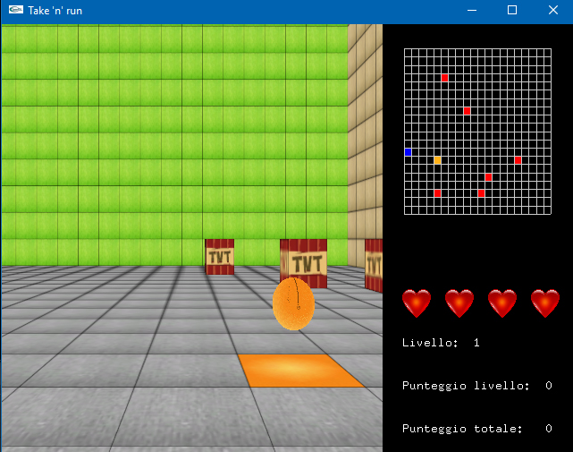

# TakeNRun

Year: 2013

Take 'N' Run [Download game for Windows](http://www.federicoforlini.com/games/TakeNRunGame.zip)

Take 'n' Run is 3d OpenGL game made by Federico Forlini and Paolo Carrara. 
The achievement of the game is to take the gold ball and run to next ball avoiding the TNT boxes.

This project is made using Glut, SOIL and Irrklang libraries.

Warning: some parts of the game (as the UI) could be in italian because the game was made for italian users.
